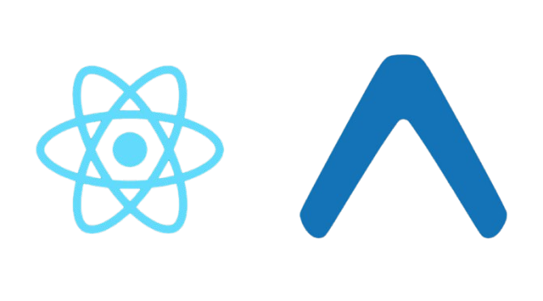

  

<h1 align="center">Hi there, I'm Vihangi Sandakirani 👋</h1>

  🌱 <b>4th Year Undergraduate at University of Kelaniya</b> 
  🎓 Pursuing Electronic and Computer Science 

---

- ## About Me

- 🖌️ **3D Designer at heart** — Blender enthusiast, passionate about bringing ideas to life in 3D  
- 💡 **AI/ML Learner** — I’m currently learning and exploring the latest in artificial intelligence and machine learning  
- 🛡️ **Cybersecurity** is a growing interest — I love learning how digital worlds stay secure  
- 🖥️ **UI/UX & Frontend Developer** — Designing and building user-centric experiences  
- ✏️ **Storyteller & Artist** — I enjoy writing stories, drawing, and solving complex math equations!  

---

## Skills

  <!-- Row 1 -->
  &nbsp;&nbsp;&nbsp;&nbsp;&nbsp;&nbsp;
  &nbsp;&nbsp;&nbsp;&nbsp;&nbsp;&nbsp;
  &nbsp;&nbsp;&nbsp;&nbsp;&nbsp;&nbsp;
  &nbsp;&nbsp;&nbsp;&nbsp;&nbsp;&nbsp;
  &nbsp;&nbsp;&nbsp;&nbsp;&nbsp;&nbsp;
  

  <!-- Row 3 -->
  &nbsp;&nbsp;&nbsp;&nbsp;&nbsp;&nbsp;
  &nbsp;&nbsp;&nbsp;&nbsp;&nbsp;&nbsp;
  &nbsp;&nbsp;&nbsp;&nbsp;&nbsp;&nbsp;
  &nbsp;&nbsp;&nbsp;&nbsp;&nbsp;&nbsp;
  &nbsp;&nbsp;&nbsp;&nbsp;&nbsp;&nbsp;
  

  <!-- Row 2 -->
  &nbsp;&nbsp;&nbsp;&nbsp;&nbsp;&nbsp;
  &nbsp;&nbsp;&nbsp;&nbsp;&nbsp;&nbsp;
  &nbsp;&nbsp;&nbsp;&nbsp;&nbsp;&nbsp;
  &nbsp;&nbsp;&nbsp;&nbsp;&nbsp;&nbsp;
  &nbsp;&nbsp;&nbsp;&nbsp;&nbsp;&nbsp;
  &nbsp;&nbsp;&nbsp;&nbsp;&nbsp;&nbsp;
  

---

## Contact Me

  &nbsp;&nbsp;&nbsp;&nbsp;&nbsp;&nbsp;&nbsp;&nbsp;
  
  &nbsp;&nbsp;&nbsp;&nbsp;&nbsp;&nbsp;&nbsp;&nbsp;
  

---

<i>“Design is intelligence made visible.”</i>

