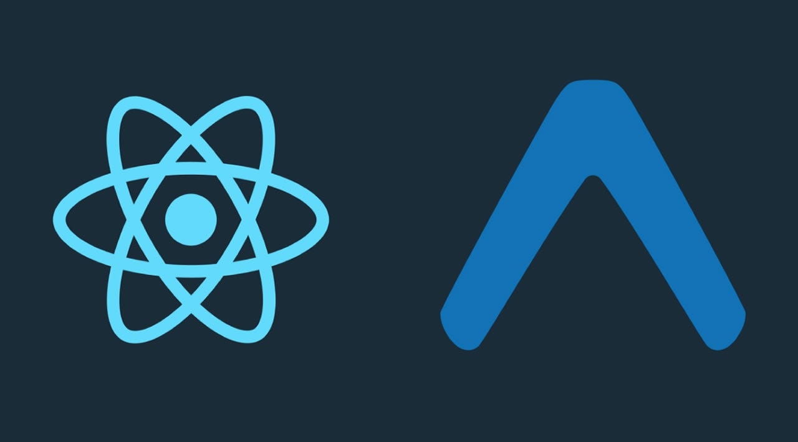

  

  <h1 align="center">Hi there, I'm Sandakirani 👋</h1>
  

    🌱 <b>4th Year Undergraduate at University of Kelaniya</b> 
    🎓 Pursuing Electronic and Computer Science 
    🔎 Actively seeking internships in <b>Frontend Development, UI/UX Design, 3D Design, and AI/ML Engineering</b>
  

---

## About Me

- 🖌️ **3D Designer at heart** — Blender enthusiast, passionate about bringing ideas to life in 3D  
- 💡 Fascinated by **AI/ML** and always exploring the latest in artificial intelligence  
- 🛡️ **Cybersecurity** is a growing interest — I love learning how digital worlds stay secure  
- 🖥️ **UI/UX & Frontend Developer** — Designing and building user-centric experiences  
- ✏️ **Storyteller & Artist** — I enjoy writing stories, drawing, and solving complex math equations!  

---

## Skills

  <!-- Java -->
  &nbsp;&nbsp;&nbsp;&nbsp;
  <!-- React -->
  &nbsp;&nbsp;&nbsp;&nbsp;
  <!-- Machine Learning (Python) -->
  &nbsp;&nbsp;&nbsp;&nbsp;
  <!-- Blender -->
  &nbsp;&nbsp;&nbsp;&nbsp;
  <!-- Figma -->
  &nbsp;&nbsp;&nbsp;&nbsp;
  <!-- Canva -->
  &nbsp;&nbsp;&nbsp;&nbsp;
  <!-- Android -->
  &nbsp;&nbsp;&nbsp;&nbsp;
  <!-- C# -->
  &nbsp;&nbsp;&nbsp;&nbsp;
  <!-- CSS -->
  &nbsp;&nbsp;&nbsp;&nbsp;
  <!-- Expo (use PNG fallback since devicon SVG is not available/public) -->
  <!-- Expo (local image) -->
&nbsp;&nbsp;&nbsp;&nbsp;
  <!-- HTML -->
  &nbsp;&nbsp;&nbsp;&nbsp;
  <!-- JavaScript -->
  &nbsp;&nbsp;&nbsp;&nbsp;
  <!-- Kotlin -->
  &nbsp;&nbsp;&nbsp;&nbsp;
  <!-- MongoDB -->
  &nbsp;&nbsp;&nbsp;&nbsp;
  <!-- PHP -->
  &nbsp;&nbsp;&nbsp;&nbsp;
  <!-- Postman -->
  &nbsp;&nbsp;&nbsp;&nbsp;
  <!-- SQLite -->
  &nbsp;&nbsp;&nbsp;&nbsp;
  <!-- Visual Studio -->
  &nbsp;&nbsp;&nbsp;&nbsp;
  <!-- VS Code -->
  

---

## Contact Me

  &nbsp;&nbsp;&nbsp;&nbsp;
  

---

<i>“Design is intelligence made visible.”</i>

